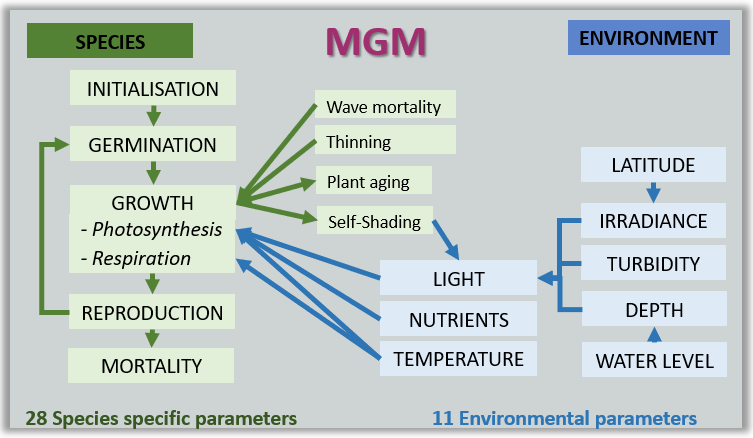
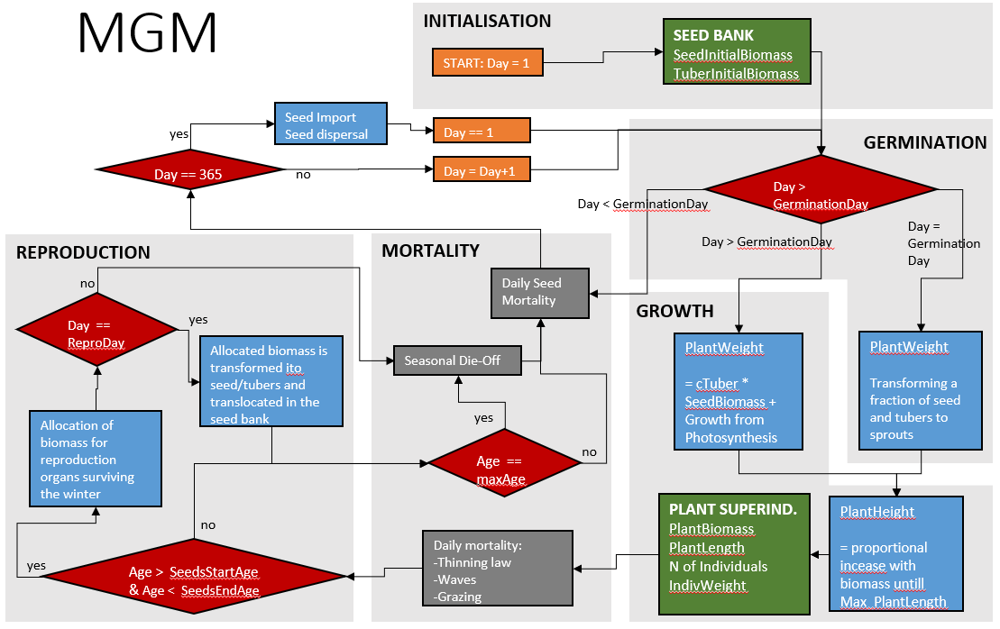

MGM - ODD document
================
Anne Lewerentz
2022-05-09

MGM (Macrophytes Growth Model) is a process-based, eco-physiological
model simulating the growth of submerged macrophytes under different
environmental conditions. MGM is a simplified re-implementation of
Charisma 2.0 (van Nes et al. 2003)in Julia language (Bezanson et al.
2017).

Charisma combined the previous models MEGAPLANT (Marten Scheffer,
Bakema, and Wortelboer 1993) and ArtiVeg (VanNes & Scheffer 1996). A
explicit manual of Charisma 2.0 can be found here at the [project
website](https://www.projectenaew.wur.nl/charisma/) .

In the following sections a short model description of the
re-implemented version is given. The model description follows the ODD
(Overview, Design concepts, Details) protocol (Grimm et al. 2006, 2010).
Furthermore, in an additional section the differences between MGM and
Charisma 2.0 are explained.

## 1. Purpose

This model is designed to simulate the growth of submerged macrophytes
under different environmental conditions in multiple depth. For this,
the model considers eco-physiological processes of macrophytes dependent
mainly on depth, irradiance, nutrient availability, wave mortality,
temperature.

<figure>
<figcaption aria-hidden="true">Simplified Model Scheme</figcaption>
</figure>

## 2. Entities, state variables, and scales

### Agents

The model simulates the life cycle of submerged macrophytes in a lake.
One time step represents one day. The model uses the super-individual
concept (see [4. Design concepts](#design-concepts)). Every
**super-individual** is defined by its biomass, number of represented
individua, its individual weight, height, and the allocated biomass for
seed or tuber production. Dependent on the selected reproductive
strategy, there can be two super-individuals, one from reproduction via
seeds and one from reproduction via tubers competing for light.

Before growing, the super-individual starts as corresponding **seeds
and/or tubers,** defined by its biomass, number of seeds or tubers, and
the allocated Biomass that will germinate in the respective year.

Each species is defined by set of species specific parameters listed in
the section [6. Input data](#Input).

### Spatial units

The model is not spatially explicit. Different depths are modeled
simultaneously without interaction.

### Environment

Lakes are defined by lake specific parameters listed in section [6.
Input data](#input). Those define the annual course of

-   water temperature (*minTemp*, *maxTemp* and *tempDelay*),

-   water level (*minW*, *maxW*, *wDelay* and *levelCorrection*),

-   water turbidity (*minKd*, *maxKd*, *kdDelay* and *backgrKd*),

-   growth limiting nutrient content (*maxNutrient*) and

-   irradiance at the water surface (*maxI* and *minI*).

Further lake specific parameters are used to calculate the hourly
photosynthetic active light reaching the species dependent on depth
(*fracReflected*, *latitude* and *parFactor*).

## 3. Process overview and scheduling

In each daily time step each super-individual will - dependent on the
day and/or the age of the plant - undergo the following processes ([see
figure](#processe)):

**Germination** starts at *germinationDay.* SeedBiomass or TuberBiomass
is start to be transferred in macrophyteBiomass dependent on a
species-specific ration (*cTuber*)*.* From this day, daily **Growth**
dependent on photosynthesis rate and respiration rate starts. The
species can grow until its maximal Age (*maxAge*) is reached (complete
die-off event). Other factor for **mortality** during the life-span can
be thinning, negative growth (Respiration rate &gt; Photosynthesis
rate), wave mortality and background mortality. Reproduction happens in
a defined time-span between *seedsStartAge* and *seedsEndAge.* Then,
daily, a part of the macrophyteBiomass is allocated (biomass is not
photosynthetically active) until *seedFraction* / *tuberFraction* is
reached. The seeds are released on the *reproDay:* the allocated biomass
for seed / tuber production is transfered into seedBiomass /
tuberBiomass. The species life-cycle within the following year starts
from the produced seedBiomass / tuberBiomass of the previous year.

<figure>
<figcaption aria-hidden="true">MGM scheduling and processes</figcaption>
</figure>

## 4. Design concepts

The model is designed as **deterministic** model, no probabilities and
stochastic processes are included. Thus, all results are completely
reproducible.

The model uses the **super-individual approach** (M. Scheffer et al.
1995). Each super-individual represents an amount of individuals which
all have the same growth rates, individual weight and height. The
advantage is to reduce computational time. As MGM is not spatially
explicit, one super-individual is used per simulation run. If multiple
depth are simulated, each depth is represented by one super-individual.
If growth from seeds and tubers is used, the model uses two
super-individuals, one from growth of seeds, and another one from
tubers.

## 5. Initialization

Each species is initialized with a distinct seed and/or tuber biomass
(*seedInitialBiomass* / *tuberInitialBiomass*) in a given depth.

## 6. Input data

To specify the input, input files defining the general settings, lake
parameters, and species parameters are necessary. Their parameters are
explained in the following three subsections. They have to be placed in
the folder “input.” If not given, the default settings from
*defaults.jl* are set.

### General settings

General settings can be set in a file named *general.config.txt*. The
following parameters are included:

| Parameter   | Unit | Description                                                                           |
|:------------|:-----|:--------------------------------------------------------------------------------------|
| years       | n    | Number of years to get simulated.                                                     |
| depths      | m    | Depths below mean water level to get simulated for. Multiple depth can be given here. |
| yearsoutput | n    | Number of last simulated years that get saved in the output files.                    |
| species     | \-   | relative paths to the species config files.                                           |
| lakes       | \-   | relative paths to the lakes config files.                                             |
| modelrun    | \-   | folder name of modelrun in output folder                                              |

### Species settings

Species specific settings can be set in the files in the *species*
folder. The following parameters can be set here:

| Parameter           | Unit                                       | Description                                                             | Applied in MGM |
|:--------------------|:-------------------------------------------|:------------------------------------------------------------------------|:---------------|
| seedsStartAge       | *d**a**y**s*                               | Age of the plants where seed formation starts                           | yes            |
| seedsEndAge         | *d**a**y**s*                               | Age of the plants where SeedFraction is reached                         | yes            |
| tuberStartAge       | *d**a**y**s*                               | Age of the plants where tuber formation starts                          | yes            |
| tuberEndAge         | *d**a**y**s*                               | Age of the plants where TuberFraction is reached                        | yes            |
| cTuber              | *f**r**a**c**t**i**o**n*                   | Fraction of tuber weight lost daily when sprouts starts growing         | yes            |
| pMax                | *h* − 1                         | Maximal gross photosynthesis                                            | yes            |
| q10                 | \-                                         | Q10 for maintenance respiration                                         | yes            |
| resp20              | *d* − 1                         | Respiration at 20                                                       | yes            |
| heightMax           | *m*                                        | Maximal Height                                                          | yes            |
| maxWeightLenRatio   | *g*                                        | Weight of 1 m young sprout                                              | yes            |
| rootShootRatio      | *f**r**a**c**t**i**o**n*                   | Proportion of plant allocated to the roots                              | yes            |
| fracPeriphyton      | *f**r**a**c**t**i**o**n*                   | Fraction of light reduced by periphyton                                 | yes            |
| hPhotoDist          | *m*                                        | Distance from plant top at which the photosynthesis is reduced factor 2 | yes            |
| hPhotoLight         | *µ**E**m* − 2*s* − 1 | Half-saturation light intensity (PAR) for photosynthesis                | yes            |
| hPhotoTemp          | °*C*                                       | Half-saturation temperature for photosynthesis                          | yes            |
| hTurbReduction      | *g**m* − 2                      | Half-saturation coefficient of extintion redusction by plant biomass    | no             |
| plantK              | *m* − 2 \* *g* − 1   | Extinction coefficient of plant issue                                   | yes            |
| pPhotoTemp          | \-                                         | Exponent in temp. effect (Hill function) for photosynthesis             | yes            |
| pTurbReduction      | \-                                         | Power in Hill function of extinction reduction by plant biomass         | no             |
| sPhotoTemp          | \-                                         | Scaling of temperature effect for photosynthesis                        | yes            |
| BackgroundMort      | *d* − 1                         | Background mortality                                                    | yes            |
| cThinning           | \-                                         | c factor of thinning function                                           | yes            |
| hWaveMort           | *m*                                        | Half-saturation depth for mortality                                     | yes            |
| germinationDay      | *d*                                        | Day of germination of seeds                                             | yes            |
| reproDay            | *d*                                        | Day of dispersal of seeds                                               | yes            |
| maxAge              | *d*                                        | Maximal plant age                                                       | yes            |
| maxWaveMort         | *d* − 1                         | Maximum loss of weight in shallow areas                                 | yes            |
| pWaveMort           | \-                                         | Power of Hill function for wave mortality                               | yes            |
| thinning            | \-                                         | if thinning is applied (TRUE / FALSE)                                   | yes            |
| hNutrient           | *m**g**l*−1                     | Half-saturation nutrient concentration for photosynthesis               | yes            |
| hNutrReduction      | *m**g**l*−1                     | half-saturation coefficient of nutrient concentration by plant biomass  | no             |
| pNutrient           | *m**g**l*−1                     | Power of Hill function for nutrient                                     | yes            |
| seedBiomass         | *g*                                        | Individual weight of seeds                                              | yes            |
| seedFraction        | *y**e**a**r* − 1                | Fraction of plant weight allocated to seeds                             | yes            |
| seedGermination     | *y**e**a**r* − 1                | Fraction of seeds that germinate                                        | yes            |
| seedInitialBiomass  | *g*                                        | Initial biomass of seeds                                                | yes            |
| seedMortality       | *d* − 1                         | daily mortality of seeds                                                | yes            |
| tuberBiomass        | *g*                                        | Individual weight of tubers                                             | yes            |
| tuberFraction       | *y**e**a**r* − 1                | Fraction of plant weight allocated to tubers                            | yes            |
| tuberGermination    | *y**e**a**r* − 1                | Fraction of tubers that germinate                                       | yes            |
| tuberGerminationDay | *d**a**y**n**o*                            | The day that tubers germinate                                           | yes            |
| tuberInitialBiomass | *g**m* − 2                      | Initial biomass of tubers                                               | yes            |
| tuberMortality      | *d* − 1                         | Mortality of tubers                                                     | yes            |

### Lake settings

Lake specific settings can be set in the files in the *lakes* folder.
The following parameters can be set here:

| Parameter       | Unit                                       | Description                                                                            | Applied in MGM |
|:----------------|:-------------------------------------------|:---------------------------------------------------------------------------------------|:---------------|
| fracReflected   | \-                                         | Light reflection at the water surface                                                  | yes            |
| iDelay          | *d*                                        | Days after 1st of January where I is minimal                                           | yes            |
| iDev            | \-                                         | Deviation factor to change total irradiation                                           | yes            |
| latitude        | °                                          | Latitude of corresponding lake                                                         | yes            |
| maxI            | *µ**E**m* − 2*s* − 1 | Maximal Irradiance                                                                     | yes            |
| minI            | *µ**E**m* − 2*s* − 1 | Minimal Irradiance                                                                     | yes            |
| parFactor       | \-                                         | Fraction of total irradiation that is PAR                                              | yes            |
| maxNutrient     | *m**g**l* − 1                   | Concentration of limiting nutrient in water                                            | yes            |
| maxTemp         | °*C*                                       | Max mean daily temperature of a year                                                   | yes            |
| minTemp         | °*C*                                       | Min mean daily temperature of a year                                                   | yes            |
| tempDelay       | *d*                                        | Days after 1st of January where Temp is minimal                                        | yes            |
| tempDev         | \-                                         | Share of temp                                                                          | yes            |
| backgrKd        | *m* − 1                         | Background light attenuation of water (Vertical light attenuation, turbidity)          | yes            |
| kdDelay         | *d*                                        | Delay, the day number with the minimal light attenuation coefficient                   | yes            |
| kdDev           | \-                                         | Deviation factor, a factor between 0 and 1 to change the whole light attenuation range | yes            |
| maxKd           | *m* − 1                         | Maximum light attenuation coefficient                                                  | yes            |
| minKd           | *m* − 1                         | Minimum light attenuation coefficient                                                  | yes            |
| levelCorrection | *m*                                        | Correction for reference level (MWL)                                                   | yes            |
| maxW            | *m*                                        | Maximal water level above MWL                                                          | yes            |
| minW            | *m*                                        | Minimal water level below MWL                                                          | yes            |
| wDelay          | *m*                                        | Delay of cosine of water level                                                         | yes            |

## 7. Submodels

See detailed description of all functions in the
[`manual of Charisma 2.0`](https://www.projectenaew.wur.nl/charisma/download/charisma_manual.pdf).
All differences and simplifications are described in section [9.
Differences to Charisma](#differences-to-charisma).

## 8. Output

The main simulation output consists of different files per species, lake
and depths. The main output types are described in the following table.
Each line in every output file represents one day, except of the
settings file. The columns are described in the table.

| File name     | Data type   | Description                                                                  | Columns within files                                                              | Unit                                                                |
|:--------------|:------------|:-----------------------------------------------------------------------------|:----------------------------------------------------------------------------------|:--------------------------------------------------------------------|
| growthSeeds   | Macrophytes | Daily Growth rates for superindividuum from seeds for selected output years  | Photosynthesis rate, Respiration rate, Growth rate                                | *g*(*g* \* *d*) − 1, *g*(*g* \* *d*) − 1, *g* |
| growthTubers  | Macrophytes | Daily Growth rates for superindividuum from tubers for selected output years | Photosynthesis rate, Respiration rate, Growth rate                                | *g*(*g* \* *d*) − 1, *g*(*g* \* *d*) − 1, *g* |
| seeds         | Macrophytes | Seedbank daily                                                               | SeedBiomass, SeedNumber, GerminatingBiomass                                       | *g*, *g*, *g*                                                       |
| tubers        | Macrophytes | Tuberbank daily                                                              | TuberBiomass, TuberNumber, GerminatingBiomass                                     | *g*, *g*, *g*                                                       |
| superInd      | Macrophytes | Sum of superIndSeed and superIndTuber, daily values                          | Biomass, Number, indWeight, Height, allocatedSeedBiomass, allocatedTurionsBiomass | *g*, *N*, *g*, *m*, *g*, *g*                                        |
| superIndSeed  | Macrophytes | Superindividuum from Seeds                                                   | Biomass, Number, indWeight, Height, allocatedSeedBiomass, allocatedTurionsBiomass | *g*, *N*, *g*, *m*, *g*, *g*                                        |
| superIndTuber | Macrophytes | Superindividuum from Tubers                                                  | Biomass, Number, indWeight, Height, allocatedSeedBiomass, allocatedTurionsBiomass | *g*, *N*, *g*, *m*, *g*, *g*                                        |
| Temp          | Environment | Daily value of water temperature                                             | Water temperature                                                                 | °*C*                                                                |
| Waterlevel    | Environment | Daily value of water level                                                   | Waterlevel                                                                        | *m**a**s**l*                                                        |
| Irradiance    | Environment | Daily value of irradiance at water surface                                   | Irradiance                                                                        | *µ**E**m* − 2*s* − 1                          |
| Light         | Environment | Daily value of light                                                         | Light                                                                             | *µ**E**m* − 2*s* − 1                          |
| Attenuation   | Environment | Daily value of light attenuation                                             | Attenuation                                                                       | *m* − 1                                                  |
| Settings      | Settings    | Storage of all used input parameters                                         | Settings                                                                          | \-                                                                  |

## 9. Differences to Charisma

This parts follows the sections within the
[`manual of Charisma 2.0`](https://www.projectenaew.wur.nl/charisma/download/charisma_manual.pdf)
and highlights the differences.

All changes were made mainly to simplify the model and to reduce
necessary species specific parameters.

The version of the model cannot be executed for multiple species. It
calculates growth of Biomass, Number of subindividuals, Individual
weight and height for two super-individuals from the same species, one
originated from seeds, one from tubers.

### The grid

MGM is not spatially explicit. But is it depth explicit (calculation of
single patches for multiple depths at once). Thus, no seed dispersal is
included, no mixing effect for light attenuation or nutrients is
included.

### Vegetation

#### Overwintering structures

No changes,but seed dispersal is not included as MGM is not spatially
explicit.

#### Growth form

Shoots spreading under the water surface is not included.

#### Respiration

No changes.

#### Primary production

Primary production depends on maximum production rate
(*P**m**a**x*), in-situ light (I), temperature (T), the
distance (D) from the tissue to the top of the plant and limiting
nutrient concentration (N). Bicarbonate concentration as limiting factor
is ignored as the studied lakes are all not carbon limited.

*P* = *P**m**a**x* \* *f*(*I*) \* *f*(*T*) \* *f*(*D*) \* *f*(*N*)

### 

#### Mortality factors

-   Background mortality and wave mortality lead to a loss in number of
    plants and biomass

-   Negative growth (Respiration &gt; Photosynthesis) leads to a loss in
    biomass

#### Grazing

Grazing is completely excluded in MGM.

#### Seasonal die-off

No changes.

### Environment

#### Light

No changes: daily total irradiation follows a sine wave over the year.

#### The effective irradiation

No changes.

#### Vertical light attenuation of the water

The extinction is modeled with a cosine function, as suggested in
Charisma 2.0

Excluded:

-   Option to read in data.

-   Clear water periods.

-   The effect of vegetation on the light attenuation.

-   Mixing the light attenuation coefficient in grids

#### Temperature

No changes: daily water temperature follows a cosine wave over the year.

No option to import data.

#### The water depth

No changes

#### The level of the grid

Irrelevant as not spatially explicit.

#### Water level

No changes: daily water level values follow a cosine wave over the year.

No option to import data.

#### Bicarbonate

Excluded.

#### Limiting nutrient

No changes.

## References

Bezanson, Jeff, Alan Edelman, Stefan Karpinski, and Viral B. Shah. 2017.
“Julia: A Fresh Approach to Numerical Computing.” *SIAM Review* 59 (1):
65–98. <https://doi.org/10.1137/141000671>.

Grimm, Volker, Uta Berger, Finn Bastiansen, Sigrunn Eliassen, Vincent
Ginot, Jarl Giske, John Goss-Custard, et al. 2006. “A Standard Protocol
for Describing Individual-Based and Agent-Based Models.” *Ecological
Modelling* 198 (1-2): 115–26.
<https://doi.org/10.1016/j.ecolmodel.2006.04.023>.

Grimm, Volker, Uta Berger, Donald L. DeAngelis, J. Gary Polhill, Jarl
Giske, and Steven F. Railsback. 2010. “The ODD Protocol: A Review and
First Update.” *Ecological Modelling* 221 (23): 2760–68.
<https://doi.org/10.1016/j.ecolmodel.2010.08.019>.

Scheffer, M., J. M. Baveco, D. L. DeAngelis, K. A. Rose, and E. H. van
Nes. 1995. “Super-Individuals a Simple Solution for Modelling Large
Populations on an Individual Basis.” *Ecological Modelling* 80 (2):
161–70. <https://doi.org/10.1016/0304-3800(94)00055-M>.

Scheffer, Marten, Aldrik H. Bakema, and Frederick G. Wortelboer. 1993.
“MEGAPLANT: A Simulation Model of the Dynamics of Submerged Plants.”
*Aquatic Botany* 45 (4): 341–56.
<https://doi.org/10.1016/0304-3770(93)90033-S>.

van Nes, Egbert H., Marten Scheffer, Marcel S. van den Berg, and Hugo
Coops. 2003. “Charisma: A Spatial Explicit Simulation Model of Submerged
Macrophytes.” *Ecological Modelling* 159 (2): 103–16.
<https://doi.org/10.1016/S0304-3800(02)00275-2>.

